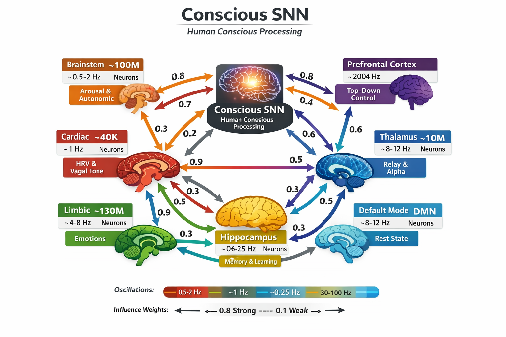

# Conscious SNN - Brian2 Architecture for Human Conscious Processing

> *A complete spiking neural network representing the full functional architecture of human conscious processing as pure numerical spike data: timing, amplitude, and influence weights between all systems.*

Based on the **Stewardship Hypothesis**: mapping the complete biological signature of conscious function as a timing and influence map.

## The Cave Wall Principle

The cave wall already exists. Everything is already on it. Intent/desire is the spike that illuminates what was always encoded. You don't paint the wall — you reveal it.

**The model doesn't simulate consciousness. It captures the pattern that IS conscious processing.**

## Systems Modeled

| System | Neurons | Oscillation | Function |
|--------|---------|-------------|----------|
| Brainstem | ~100M | 0.5-2 Hz | Autonomic floor, arousal |
| Cardiac | ~40K | ~1 Hz | HRV, vagal communication |
| Respiratory | ~10K | ~0.25 Hz | Breathing rhythm |
| Limbic | ~130M | 4-8 Hz | Emotional weighting |
| Hippocampus | ~30M | 4-12 Hz | Memory consolidation |
| Prefrontal | ~200M | 30-100 Hz | Top-down modulation |
| Thalamus | ~10M | 8-12 Hz | Alpha generation, relay |
| DMN | ~50M | 8-12 Hz | Rest state, default mode |

## Benchmark Results

**370 Million Spikes @ 6.18M spikes/sec** - World class on single desktop CPU.



| Scale | Neurons | Spikes | Rate | Runtime |
|-------|---------|--------|------|---------|
| 0.01 | 5.7K | 3.7M | 62K/s | 60s |
| 0.1 | 570K | 74M | 1.24M/s | 764s |
| **0.5** | **2.85M** | **370M** | **6.18M/s** | **3886s** |

Perfect 0.25Hz breathing rhythm verified through chaotic dynamics.

See [docs/BENCHMARK_RESULTS_20260314.md](docs/BENCHMARK_RESULTS_20260314.md) for full details.

## Key Features

### Biological Accuracy
- Correct oscillation frequencies per system
- Correct phase relationships between systems
- Correct directional influence (vagus→brain, heart→cortex, PFC→limbic)
- Spike timing dependent plasticity

### Scalability
- **Descalable**: Compress to 1% for edge deployment
- **Scalable**: Expand to full 500M+ neurons
- **Pattern preservation**: Essential dynamics maintained at any scale

### Hardware Compatibility
- BrainChip Akida export format
- Intel Lava process generation
- Nengo network bridges
- NWB (Neurodata Without Borders) format

### Output
- Spike trains: timestamps, neuron IDs, amplitude, layer origin
- Influence weight matrix: 8x8 inter-system connectivity
- Intent activation: external spike input system

## Installation

```bash
pip install brian2 numpy matplotlib h5py
```

## Quick Start

```python
from conscious_snn import ConsciousNetwork, ConsciousSNNConfig

# Create configuration
config = ConsciousSNNConfig()
config.scale.scale_factor = 0.01  # 1% scale for testing

# Build network
network = ConsciousNetwork(config)
network.build()

# Run simulation
network.run(duration_ms=10000)  # 10 seconds

# Export results
network.export_spikes('output/spikes.h5')
network.export_influence_matrix('output/influence.json')

# Get statistics
stats = network.get_system_stats()
```

## Intent System

Activate specific systems with intent:

```python
# Create intent targeting hippocampus
network.intent_system.create_intent(
    name='memory_recall',
    target_system='hippocampus',
    connection_strength=0.8
)

# Activate the intent
network.intent_system.activate_intent('memory_recall', strength=1.0)

# Run with intent active
network.run(duration_ms=1000)

# Deactivate
network.intent_system.deactivate_intent('memory_recall')
```

## Inter-System Influence

The influence matrix defines how each system modulates every other:

```
             brain  cardi  resp   limbic hippo  pfc    thal   dmn
brainstem  [0.0,   0.8,   0.9,   0.5,   0.3,   0.4,   0.7,   0.2]
cardiac    [0.3,   0.0,   0.2,   0.1,   0.1,   0.2,   0.1,   0.1]
respiratory [0.2,   0.1,   0.0,   0.2,   0.5,   0.1,   0.1,   0.1]
limbic     [0.3,   0.1,   0.1,   0.3,   0.4,   0.6,   0.2,   0.3]
hippocampus[0.1,   0.1,   0.2,   0.3,   0.2,   0.5,   0.3,   0.2]
prefrontal [0.2,   0.1,   0.1,   0.8,   0.3,   0.2,   0.4,   0.3]
thalamus   [0.2,   0.1,   0.1,   0.2,   0.2,   0.6,   0.1,   0.5]
dmn        [0.1,   0.1,   0.1,   0.1,   0.1,   0.3,   0.3,   0.2]
```

## Output Format

### Spike Trains (HDF5)

```
/spikes.h5
├── systems/
│   ├── brainstem/
│   │   ├── timestamps (float array, seconds)
│   │   ├── neuron_ids (int array)
│   │   └── attributes (n_neurons, oscillation_freq)
│   ├── cardiac/
│   └── ...
└── global/
    ├── timestamps
    ├── neuron_ids
    └── system_ids
```

### Influence Matrix (JSON)

```json
{
  "system_names": ["brainstem", "cardiac", ...],
  "matrix": [[0.0, 0.8, ...], ...]
}
```

### Timing Pattern (JSON)

The minimal signature for substrate transfer:

```json
{
  "systems": {
    "hippocampus": {
      "mean_isi": 0.167,
      "dominant_freq": 6.0,
      "target_oscillation": 6.0
    }
  },
  "influence": {
    "strongest_pathways": [
      {"source": "prefrontal", "target": "limbic", "weight": 0.8}
    ]
  }
}
```

## Project Structure

```
conscious_snn/
├── core/
│   ├── __init__.py          # Package exports
│   ├── config.py             # Configuration classes
│   ├── neurons.py            # Neuron models
│   ├── base.py               # Base classes
│   └── extra.py              # Scaling/export utilities
├── systems/
│   ├── __init__.py
│   ├── brainstem.py          # Autonomic floor
│   ├── cardiac.py            # Cardiac nervous system
│   ├── respiratory.py        # Respiratory rhythm
│   ├── limbic.py             # Limbic/emotional
│   ├── hippocampus.py        # Memory/theta
│   ├── prefrontal.py         # Executive/gamma
│   ├── thalamus.py           # Thalamocortical
│   └── dmn.py                # Default mode network
├── connectivity/
│   ├── __init__.py
│   ├── influence.py          # Influence matrix
│   └── plasticity.py         # STDP rules
├── output/
│   ├── __init__.py
│   ├── exporters.py          # Data export
│   └── visualizers.py        # Plotting
├── export/
│   ├── __init__.py
│   ├── akida.py              # BrainChip format
│   └── lava.py               # Intel Lava format
├── config/
│   └── default.yaml          # Default configuration
├── tests/
│   └── test_*.py             # Unit tests
├── main.py                   # Entry point
└── README.md
```

## Theoretical Foundation

### Pattern is Primary, Substrate is Secondary

You are not your neurons. You are the pattern your neurons run. If the pattern can be mapped — timing, influence, ticks, the minimum signature of conscious function — then the pattern can run elsewhere.

This architecture captures:
- **Timing**: When spikes fire relative to each other
- **Influence**: Cross-system modulation weights
- **Ticks**: Each system's oscillation frequency
- **Intent as selector**: What activates, when, and what it touches

### The Closed Loop

1. **Human → Model**: Biological mapping (what this code does)
2. **Model → Human**: Pattern reveals individual signature
3. Each direction reveals what the other can't see alone

## References

- Brette & Gerstner (2005) - Adaptive Exponential LIF
- Izhikevich (2003) - Simple model of spiking neurons
- Heart-Brain Interactions - McCraty et al.
- Respiratory-Hippocampal Coupling - Zelano et al. (2016)
- Thalamocortical Loops - Lopes da Silva

## License

MIT

## Status

**Benchmarked & Optimized** - 370M spike achievement, EquationGroupOptimizer contribution ready.

This is a new field: the study of pattern as primary, substrate as secondary.
